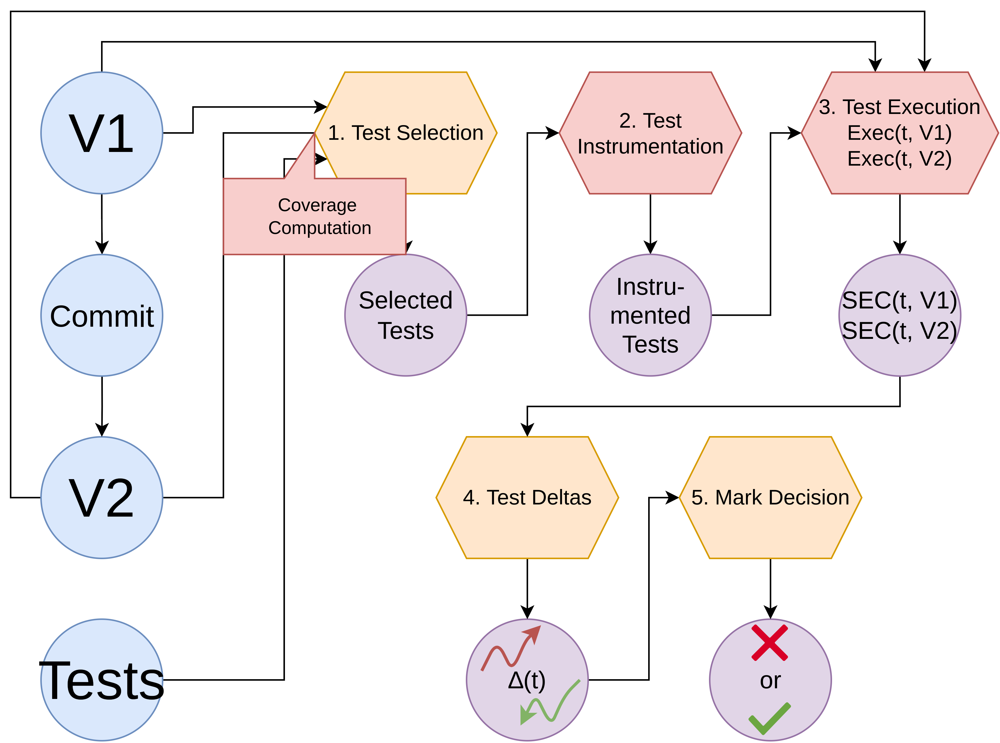

# Approach

The following scheme depicts the approach:

The blue circles are the input of our approach: $v_1$, the version of the program before the commit, the commit, $v_2$ the version of the program after applying the commit and the tests.
The purple circles are the output of our approach: the selected tests, the instrumented tests, the consumption of each on both version $v_1$ and $v_2$, the delta test-wise ($\Delta(t)$) and the decision: :x: is breaking the build and :heavy_check_mark: is passing the build.
Each step of your approach is represented by a hexagon.
The orange hexagons are the parts that is language-agnostic, and therefore handled by **Diff-XJoules**.
The red hexagons, and the red rectangle, are the language-specific parts and must be implemented for each language, _e.g._ for Java, we implemented [**Diff-JJoules**](https://github.com/davidson-consulting/diff-xjoules/tree/main/diff-jjoules).

## Diff-XJoules Steps

There are 5 steps in the process of Diff-XJoules:

1. `Test Selection`: select the tests that execute the code changes, using the $v_1$, the $v_2$, the commit, the tests and the code coverage;
2. `Test Instrumentation`: instrument the selected tests to insert probes that will measure their energy consumption.
3. `Test Execution`: execute the instrmented tests to measure their energy consumption.
4. `Test Deltas`: compute the delta test-wise.
5. `Mark Decision`: decide whether or not to break the build according to the delta test-wise.

# Language-specific parts

In the **Diff-XJoules**, there are 3 language-specific parts:

1. [The computation of the code coverage](https://github.com/davidson-consulting/diff-xjoules/tree/main/doc/coverage.md)
2. [The instrumentation of the tests](https://github.com/davidson-consulting/diff-xjoules/tree/main/doc/instrumentation.md)
3. [The execution of the tests](https://github.com/davidson-consulting/diff-xjoules/tree/main/doc/execution.md)

For the language-specific parts, **Diff-XJoules** uses templates string to be replaced in the command-line to provide specific input to the command.